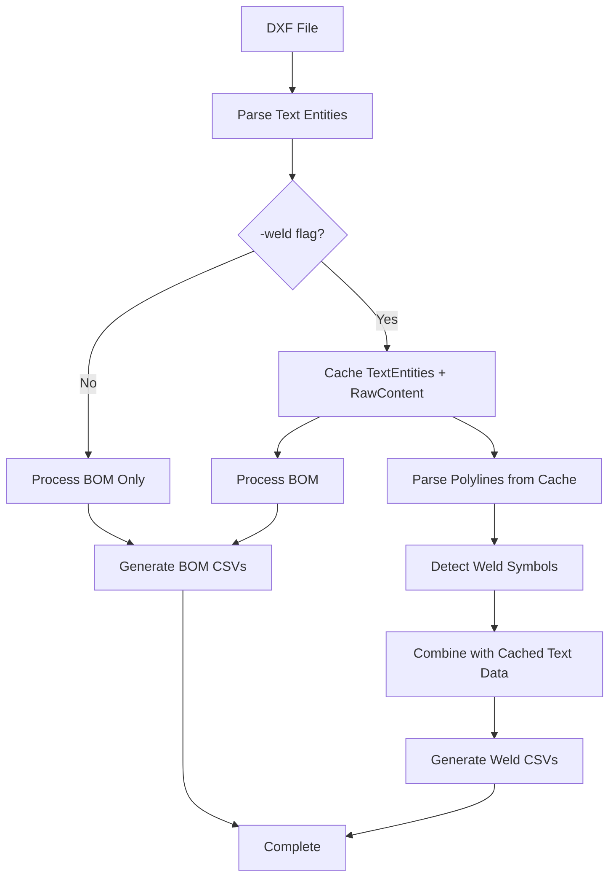

# Weld Detection Integration Plan

## Project Overview
Enhance the existing `bom_cut_length_extractor.exe` to include weld detection capabilities via a `-weld` flag, optimized for processing 1600+ files efficiently with minimal I/O while preserving all existing BOM functionality.

## Objectives
- ✅ **Zero Impact**: Preserve all existing BOM extraction functionality 
- ✅ **Performance**: Optimize for processing 1600+ files efficiently
- ✅ **Single Pass**: Read each DXF file only once for both BOM and weld processing
- ✅ **Reliability**: Isolated error handling - weld failures don't affect BOM output
- ✅ **Consistency**: Match standalone `weld_detector.exe` accuracy and output format

## Technical Requirements

### 1. Data Processing Strategy
- **BOM Phase**: Extract and cache `TextEntity` objects during normal BOM processing
- **Weld Phase**: Parse polylines separately, then combine cached text entities with fresh weld data for CSV output
- **Raw Content Caching**: Cache raw DXF file content alongside text entities to enable polyline parsing without re-reading files

### 2. Caching Architecture
```go
type FileCache struct {
    TextEntities []TextEntity
    RawContent   []byte  // for polyline parsing
    FilePath     string
    FileName     string
}

// Per-worker private caches for maximum performance
type WorkerContext struct {
    WorkerID    int
    FileCache   map[string]FileCache
    BOMResults  []DXFResult
    WeldResults []WeldResult
}
```

### 3. Output File Structure
Follow BOM naming convention for consistency:
- `0001_ERECTION_MATERIALS.csv` (existing)
- `0002_CUT_PIPE_LENGTH.csv` (existing)  
- `0003_AGGREGATED_MATERIALS.csv` (existing)
- `0004_SUMMARY.csv` (existing)
- `0005_WELD_COUNTS.csv` **[NEW]**
- `0006_WELD_AGGREGATED.csv` **[NEW]** (if applicable)

### 4. Command Line Interface
```bash
# Existing BOM-only (unchanged)
./bom_cut_length_extractor.exe bom -dir drawings_folder

# New combined BOM + Weld
./bom_cut_length_extractor.exe bom -dir drawings_folder -weld

# With existing flags
./bom_cut_length_extractor.exe bom -dir drawings_folder -weld -debug -workers 8
```

## Implementation Plan

### Phase 1: Foundation Setup
**Files to modify:**
- `cut_length_extractor.go`

**Tasks:**
1. Add `-weld` flag to command line parsing
2. Add `weldFlag` parameter to `runBOMExtraction()` function
3. Update help text and usage information

**Code Changes:**
```go
// Add flag declaration
var weldFlag bool
flag.BoolVar(&weldFlag, "weld", false, "Generate weld detection CSV files (0005_WELD_COUNTS.csv)")

// Update function signature
func runBOMExtraction(directory string, debug bool, workers int, weldFlag bool)
```

### Phase 2: Caching Infrastructure
**Files to create:**
- `weld_integration.go`

**Tasks:**
1. Define data structures for file caching
2. Implement per-worker caching logic
3. Create cache management functions

**Code Structure:**
```go
// weld_integration.go
package main

type FileCache struct {
    TextEntities []TextEntity
    RawContent   []byte
    FilePath     string
    FileName     string
}

type WeldResult struct {
    FilePath       string
    FileName       string  
    DrawingNo      string  // from cached text entities
    PipeClass      string  // from cached text entities
    WeldCount      int     // from polyline detection
    ProcessingTime float64
    Error          string
}

func createWorkerCaches(numWorkers int) []map[string]FileCache
func mergeWorkerCaches(workerCaches []map[string]FileCache) map[string]FileCache
func processWeldDetection(fileCache map[string]FileCache) []WeldResult
```

### Phase 3: BOM Processing Enhancement
**Files to modify:**
- `cut_length_extractor.go`

**Tasks:**
1. Modify file processing loop to conditionally cache data when `-weld` flag is present
2. Update worker processing to include caching
3. Ensure zero performance impact when `-weld` not used

**Key Changes:**
```go
// In runBOMExtraction function
var globalFileCache map[string]FileCache
if weldFlag {
    globalFileCache = make(map[string]FileCache)
}

// In worker processing loop
if weldFlag {
    // Cache text entities and raw content
    workerCache[filePath] = FileCache{
        TextEntities: entities,
        RawContent:   rawContent,
        FilePath:     filePath,
        FileName:     filepath.Base(filePath),
    }
}
```

### Phase 4: Weld Detection Integration
**Files to enhance:**
- `weld_integration.go`

**Tasks:**
1. Extract weld detection logic from `weld_detector.go`
2. Adapt polyline parsing to work with cached raw content
3. Implement weld symbol detection using existing algorithms
4. Extract drawing numbers and pipe classes from cached text entities

**Core Functions:**
```go
func extractWeldsFromPolylines(rawContent []byte) ([]WeldSymbol, error)
func findDrawingNoFromEntities(entities []TextEntity) string
func findPipeClassFromEntities(entities []TextEntity) string
func detectWeldSymbols(segments []PolylineSegment) []WeldSymbol
```

### Phase 5: CSV Output Generation
**Files to enhance:**
- `weld_integration.go`
- `bom_utils.go` (potentially for shared CSV writing functions)

**Tasks:**
1. Implement weld CSV writing functions
2. Follow existing CSV output patterns from BOM extraction
3. Ensure output format matches standalone `weld_detector.exe`

**Functions:**
```go
func writeWeldCSVs(results []WeldResult, outputDir string) error
func writeWeldCountsCSV(filename string, results []WeldResult) error
func writeWeldAggregatedCSV(filename string, results []WeldResult) error
```

### Phase 6: Memory Management & Performance
**Files to enhance:**
- `cut_length_extractor.go`
- `weld_integration.go`

**Tasks:**
1. Implement chunked processing for 1600+ files
2. Add memory monitoring and cleanup
3. Optimize for minimal I/O

**Features:**
```go
const (
    MAX_FILES_PER_CHUNK = 300
    MAX_MEMORY_MB       = 4096
)

func processInChunks(files []string, chunkSize int, weldFlag bool)
func cleanupFileCache(cache map[string]FileCache)
func estimateMemoryUsage(cache map[string]FileCache) int64
```

### Phase 7: Error Handling & Isolation
**Files to enhance:**
- `weld_integration.go`
- `cut_length_extractor.go`

**Tasks:**
1. Implement isolated error handling for weld processing
2. Ensure BOM processing continues even if weld detection fails
3. Add comprehensive error logging

**Error Strategy:**
```go
// Weld errors are captured but don't stop BOM processing
func processWeldDetectionSafe(cache map[string]FileCache) []WeldResult {
    var results []WeldResult
    for filePath, fileCache := range cache {
        result := WeldResult{FilePath: filePath, FileName: filepath.Base(filePath)}
        
        // Safe weld processing with error capture
        if weldCount, err := extractWeldsFromFile(fileCache); err != nil {
            result.Error = err.Error()
        } else {
            result.WeldCount = weldCount
        }
        
        results = append(results, result)
    }
    return results
}
```

### Phase 8: Testing & Validation
**Files to create:**
- `weld_integration_test.go`

**Tasks:**
1. Create comprehensive test suite
2. Validate BOM output remains identical
3. Verify weld detection accuracy
4. Performance testing for large file sets

**Test Coverage:**
```go
func TestBOMOutputIdentical(t *testing.T)
func TestWeldAccuracy(t *testing.T) 
func TestLargeVolumePerformance(t *testing.T)
func TestErrorIsolation(t *testing.T)
func TestMemoryUsage(t *testing.T)
func TestChunkedProcessing(t *testing.T)
```

## Performance Targets

### Processing Speed
- **1600+ files**: Complete processing in <30 minutes
- **Memory efficiency**: Stay under 4GB with chunked processing
- **Zero BOM impact**: No slowdown when `-weld` flag not used
- **Single-pass I/O**: Read each DXF file only once

### Concurrency Strategy
```go
// Per-worker private caches to avoid locking overhead
func processWithWorkerCaches(files []string, workers int, weldFlag bool) {
    workerCaches := createWorkerCaches(workers)
    
    // Process BOM with caching in parallel
    processBOMWithCaching(files, workers, weldFlag, workerCaches)
    
    // Merge caches from all workers
    globalCache := mergeWorkerCaches(workerCaches)
    
    // Process welds sequentially using merged cache
    if weldFlag {
        weldResults := processWeldDetection(globalCache)
        writeWeldCSVs(weldResults, outputDir)
    }
    
    // Cleanup
    cleanupFileCache(globalCache)
}
```

## File Structure Changes

### New Files
```
weld_integration.go          # Core weld detection integration
weld_integration_test.go     # Comprehensive test suite
WELD_INTEGRATION_PLAN.md     # This planning document
```

### Modified Files
```
cut_length_extractor.go      # Add -weld flag, caching logic
build.bat                    # Update to include new files (if needed)
README.md                    # Update documentation with new -weld flag
```

### Output Files (New)
```
0005_WELD_COUNTS.csv         # Individual file weld counts
0006_WELD_AGGREGATED.csv     # Aggregated weld statistics (optional)
```

## Data Flow Architecture



## Success Metrics

### Functional Requirements
- ✅ **BOM Preservation**: BOM CSVs identical with/without `-weld` flag
- ✅ **Weld Accuracy**: Weld CSVs match standalone `weld_detector.exe` accuracy  
- ✅ **Large Scale**: Successfully process 1600+ files efficiently
- ✅ **Error Isolation**: Weld failures don't affect BOM output
- ✅ **Performance**: Zero impact on BOM-only processing

### Quality Requirements
- ✅ **Test Coverage**: Comprehensive automated test suite
- ✅ **Documentation**: Updated README and inline documentation
- ✅ **Maintainability**: Clean, modular code structure
- ✅ **Backward Compatibility**: Existing workflows remain unchanged

## Implementation Timeline

| Phase | Duration | Deliverables |
|-------|----------|--------------|
| Phase 1 | 1 day | Basic flag integration |
| Phase 2 | 2 days | Caching infrastructure |
| Phase 3 | 2 days | BOM processing enhancement |
| Phase 4 | 3 days | Weld detection integration |
| Phase 5 | 2 days | CSV output generation |
| Phase 6 | 2 days | Performance optimization |
| Phase 7 | 1 day | Error handling |
| Phase 8 | 3 days | Testing & validation |
| **Total** | **16 days** | **Complete integration** |

## Risk Mitigation

### Technical Risks
- **Memory Usage**: Mitigated by chunked processing and memory monitoring
- **Performance Degradation**: Mitigated by per-worker caches and conditional processing
- **Accuracy Issues**: Mitigated by reusing proven weld detection algorithms

### Quality Risks
- **Regression**: Mitigated by comprehensive automated testing
- **Integration Issues**: Mitigated by phased implementation and validation
- **Maintainability**: Mitigated by clean code structure and documentation

## Conclusion

This plan provides a comprehensive roadmap for integrating weld detection into the BOM extractor while maintaining all existing functionality and optimizing for large-scale processing. The phased approach ensures reliable delivery with minimal risk to existing systems.
